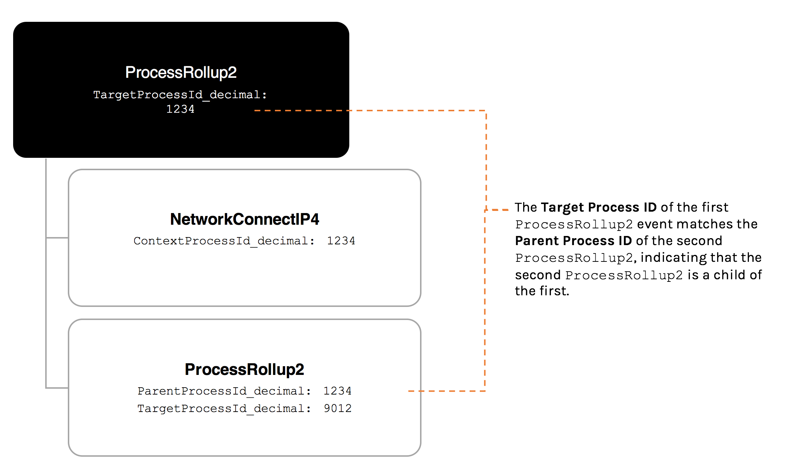

# ProcessRollup2

# Description

Platforms: ChromeOS, Windows Legacy, Forensics

## Platforms: Windows, macOS

This event (often called "PR2" for short) is generated for a process that is running or has finished running on a host and contains information about that process. For every ProcessRollup2 event, there is a corresponding event that is generated when a process completes. The name of this event is EndOfProcess for Windows and Mac and TerminateProcess for Linux.

Important: This event is generated on Windows, Mac, and Linux sensors. However, because of the way Mac and Linux manage processes at the kernel level, the Falcon sensors for these platforms are configured to send ProcessRollup2 information in a second event called ProcessRollup2Stats. For more information, see ProcessRollup2Stats.

# Understanding TargetProcessId_decimal

Every ProcessRollup2 event contains a field called TargetProcessId_decimal. This ID is generated internally by the sensor, and will be unique for every instance of a process. For example, if you run cmd.exe twice, you will see two different ProcessRollup2 events with two unique values for TargetProcessId_decimal. This ID should not be confused with the host operating system PID for the process, which will be a different value.

# Understanding ContextProcessId_decimal

Processes often generate multiple, if not dozens of related events. For example, opening a browser or running an executable can generate network connectivity events, temporary file write events, DNS request events, etc. We therefore need a way to understand the parent-child relationship between processes and the events they generate.

Every event that is generated by a ProcessRollup2 contains a data field called ContextProcessId_decimal. The ContextProcessId_decimal will match the TargetProcessId_decimal of its parent ProcessRollup2 event. In the example below, the ContextProcessId_decimal values indicate that each of the events are children of the parent ProcessRollup2events.

<!-- ProcessRollup2 ProcessRollup2 TargetProcessId_decimal: TargetProcessId_decimal: 1234 5678 The Target Process ID of the NetworkConnectlP4 PEFileWritten ProcessRollup2 event matches the Context Process ContextProcessId_decimal: ContextProcessId_decimal: 1234 5678 ID of the InjectedThread event.InjectedThreadis therefore the child of this ProcessRollup2 event. DnsRequest InjectedThread ContextProcessId_decimal: ContextProcessId_decimal: 1234 5678 -->

By searching for events that have matching values for ContextProcessId_decimal and TargetProcessId_decimal, you can see a list of all events that were generated as a result of a ProcessRollup2 event.

# Understanding ParentProcessld_decimal

As previously mentioned, every process that executes on a host has a corresponding ProcessRollup2 event. This means that when a process spawns another process, a brand new ProcessRollup2 event will be generated for that new ProcessRollup2event. This new event will contain a field called ParentProcessId_decimal.The ParentProcessId_decimal of the child PR2 will match the TargetProcessId_decimal of the parent PR2, as shown below:

By searching for events that have matching values for ParentProcessId_decimal and TargetProcessId_decimal, you can determine the parent-child relationship of multiple ProcessRollup2 events.

## Platforms: Linux, Falcon Container, Android

This event (often called "PR2" for short) is generated for a process that is running or has finished running on a host and contains information about that process. For every ProcessRollup2 event, there is a corresponding event that is generated when a process completes. The name of this event is EndOfProcess for Windows and Mac and TerminateProcess for Linux.

| Important: This event is generated on Windows, Mac, and Linux sensors. However, because of the way Mac and Linux manage processes at the kernel level, the Falcon sensors for these platforms are configured to send ProcessRollup2 information in a second event called ProcessRollup2Stats. For more information, see ProcessRollup2Stats.  |
| --- |

Fields: Windows Legacy

| Field  | Description  |
| --- | --- |
| TargetProcessId  | The unique ID of a target process (in decimal, non-hex format). This field exists in almost all events, and it represents the ID of the process that is responsible for the activity of the event in focus. For example, the TargetProcessId of a process that performed thread injection in an InjectedThread event  |
| SourceProcessId  | UPID of creating process. Note that in Windows [http://msdn.microsoft.com/en-us/library/windows/hardware/ff559960%28v=vs.85%29.aspx] , the ParentProcessId does not have to be the same as SourceProcessId since a different parent can be specified for creation. On Mac, SourceProcessId is the responsible_pid which is used by XPC to note the process requesting this XPC process.  |
| SourceThreadId  | UTID of thread from creating process. See the description for the SourceProcessId field for more details.  |
| ParentProcessId  | The decimal representation of the parent process.  |
| ImageFileName  | The full path to an executable (PE) file. The context of this field provides more information as to its meaning. For ProcessRollup2 events, this is the full path to the main executable for the created process.  |
| CommandLine  | The command line used to create this process. May be empty in some circumstances, visit here [http://msdn.microsoft.com/en-us/library/windows/desktop/ms682425(v=vs.85).aspx] for more information.  |
| RawProcessId  | The operating system’s internal PID. For matching, use the UPID fields which guarantee a unique process identifier  |
| SHA256HashData  | The SHA256 hash of a file. In most cases, the hash of the file referred to by the ImageFileName field. Values: STATIC_SHA256_DOPPELGANGING (0x56f3097c4d5bf4c7cffef168ee732e1c78f2ee62bc1c1ba61c219226bef619f8) STATIC_SHA256_SYSTEM (0x03312a19baa7ab137c09127c6feb58c05216a7880d3c9e6ae54a8bcda460f92a)  |
| ProcessStartTime  | The time the process began in UNIX epoch time (in decimal, non-hex format).  |
| ProcessEndTime  | The time the process finished (in decimal, non-hex format).  |
| SHA1HashData  | The SHA1 hash of a file.  In most cases, the hash of the file referred to by the ImageFileName field.  |
| MD5HashData  | The MD5 hash of a file  |
| TreeId  | If this event is part of a detection tree, the tree ID it is part of.  |
| SessionId  | Value that indicates the Terminal Services session identifier associated with the token.  |
| Tags  | Field used for Falcon diagnostic information.  |
| ParentBaseFileName  | The base ImageFileName of the parent process.  |
| GrandParentBaseFileName  |  The base ImageFileName of the grand parent process.  |

<!-- https://falcon.us-2.crowdstrike.com/documentation/page/e3ce0b24/events-data-dictionary Page 517 of 1,282 -->

<!-- Events Full Reference (Events Data Dictionary) | Events | Event Investigation | Documentation | Support and resources | Falcon 2024-10-04, 8:47 AM -->

Fields: Windows

| Field  | Description  |
| --- | --- |
| TargetProcessId  | The unique ID of a target process (in decimal, non-hex format). This field exists in almost all events, and it represents the ID of the process that is responsible for the activity of the event in focus. For example, the TargetProcessId of a process that performed thread injection in an InjectedThread event  |
| SourceProcessId  | UPID of creating process. Note that in Windows [http://msdn.microsoft.com/en-us/library/windows/hardware/ff559960%28v=vs.85%29.aspx] , the ParentProcessId does not have to be the same as SourceProcessId since a different parent can be specified for creation. On Mac, SourceProcessId is the responsible_pid which is used by XPC to note the process requesting this XPC process.  |
| SourceThreadId  | UTID of thread from creating process. See the description for the SourceProcessId field for more details.  |
| ParentProcessId  | The decimal representation of the parent process.  |
| ImageFileName  | The full path to an executable (PE) file. The context of this field provides more information as to its meaning. For ProcessRollup2 events, this is the full path to the main executable for the created process.  |
| CommandLine  | The command line used to create this process. May be empty in some circumstances, visit here [ http://msdn.microsoft.com/en-us/library/windows/desktop/ms682425(v=vs.85).aspx] for more information.  |
| RawProcessId  | The operating system’s internal PID. For matching, use the UPID fields which guarantee a unique process identifier  |
| UserSid  | The User Security Identifier (UserSID) of the user who executed the command. A UserSID uniquely identifies a user in a system. Values: SELF_RID (0x01010000000000050A000000)  |
| AuthenticationId  | Values: INVALID_LUID (0) NETWORK_SERVICE (996) LOCAL_SERVICE (997) SYSTEM (999) RESERVED_LUID_MAX (1000)  |
| SHA256HashData  | The SHA256 hash of a file. In most cases, the hash of the file referred to by the ImageFileName field. Values: STATIC_SHA256_DOPPELGANGING (0x56f3097c4d5bf4c7cffef168ee732e1c78f2ee62bc1c1ba61c219226bef619f8) STATIC_SHA256_SYSTEM (0x03312a19baa7ab137c09127c6feb58c05216a7880d3c9e6ae54a8bcda460f92a)  |
| SHA1HashData  | The SHA1 hash of a file.  In most cases, the hash of the file referred to by the ImageFileName field.  |
| MD5HashData  | The MD5 hash of a file  |
| ProcessStartTime  | The time the process began in UNIX epoch time (in decimal, non-hex format).  |
| ProcessEndTime  | The time the process finished (in decimal, non-hex format).  |
| TreeId  | If this event is part of a detection tree, the tree ID it is part of.  |
| ImageSubsystem  | Values: UNKNOWN (0x0) NATIVE (0x1) GUI (0x2) CUI (0x3) POSIX_CUI (0x7) WINDOWS_BOOT_APPLICATION (0x10) IMAGE_SUBSYSTEM_UNKNOWN (0x0) IMAGE_SUBSYSTEM_NATIVE (0x1) IMAGE_SUBSYSTEM_WINDOWS_GUI (0x2) IMAGE_SUBSYSTEM_WINDOWS_CUI (0x3) IMAGE_SUBSYSTEM_POSIX_CUI (0x7) IMAGE_SUBSYSTEM_WINDOWS_BOOT_APPLICATION (0x10) IMAGE_SUBSYSTEM_WSL (0x100)  |
| IntegrityLevel  | Values: UNTRUSTED (0x00000000) LOW (0x00001000) MEDIUM (0x00002000) MEDIUM_PLUS (0x00002100) HIGH (0x00003000) SYSTEM (0x00004000) PROTECTED (0x00005000)  |
| ProcessCreateFlags  | Captured flags from original process create. This is a bitfield. More information [https://msdn.microsoft.com/en->us/library/windows/desktop/ms684863.aspx] . Values: DEBUG_PROCESS (0x00000001) DEBUG_ONLY_THIS_PROCESS (0x00000002) CREATE_SUSPENDED (0x00000004) DETACHED_PROCESS (0x00000008) CREATE_NEW_CONSOLE (0x00000010) CREATE_NEW_PROCESS_GROUP (0x00000200) CREATE_UNICODE_ENVIRONMENT (0x00000400) CREATE_SEPARATE_WOW_VDM (0x00000800) CREATE_SHARED_WOW_VDM (0x00001000) CREATE_FORCEDOS (0x00002000) INHERIT_PARENT_AFFINITY (0x00010000) CREATE_PROTECTED_PROCESS (0x00040000) EXTENDED_STARTUPINFO_PRESENT (0x00080000) PROCESS_MODE_BACKGROUND_BEGIN (0x00100000) PROCESS_MODE_BACKGROUND_END (0x00200000) CREATE_BREAKAWAY_FROM_JOB (0x01000000) CREATE_PRESERVE_CODE_AUTHZ_LEVEL (0x02000000) CREATE_DEFAULT_ERROR_MODE (0x04000000) CREATE_NO_WINDOW (0x08000000) PROFILE_USER (0x10000000) PROFILE_KERNEL (0x20000000) PROFILE_SERVER (0x40000000) CREATE_IGNORE_SYSTEM_DEFAULT (0x80000000) COMMON_EXPLORER_SUSPENDED_SET (0x04080414)  |
| ProcessParameterFlags  | Flags from the ‘NtCreateUserProcess’ API. This bitfield includes data like if DLL redirection is enabled. Values: RTL_USER_PROC_PARAMS_NORMALIZED (0x00000001) RTL_USER_PROC_PROFILE_USER (0x00000002) RTL_USER_PROC_PROFILE_KERNEL (0x00000004) RTL_USER_PROC_PROFILE_SERVER (0x00000008) RTL_USER_PROC_RESERVE_1MB (0x00000020) RTL_USER_PROC_RESERVE_16MB (0x00000040) RTL_USER_PROC_CASE_SENSITIVE (0x00000080) RTL_USER_PROC_DISABLE_HEAP_DECOMMIT (0x00000100) RTL_USER_PROC_DLL_REDIRECTION_LOCAL (0x00001000) RTL_USER_PROC_APP_MANIFEST_PRESENT (0x00002000) RTL_USER_PROC_IMAGE_KEY_MISSING (0x00004000) RTL_USER_PROC_OPTIN_PROCESS (0x00020000) RTL_USER_PROC_CREATE_NEW_SESSION (0x00040000) RTL_USER_PROC_USER_CALLBACK_FILTER (0x00080000) RTL_USER_PROC_DISABLE_LFH_RANDOMIZATION (0x00100000) RTL_USER_PROC_APPCOMPAT_DLL_REDIRECTION (0x00200000) RTL_USER_PROC_PROTECTED (0x00400000)  |
| ProcessSxsFlags  | Flags from the communications path with the Windows Subsystem Process. This bitfield includes data like if there’s a manifest and if it’s local or not. Values: BASE_SXS_HAS_MANIFEST (0x00000001) BASE_SXS_HAS_POLICY (0x00000002) BASE_SXS_HAS_ASSEMBLY (0x00000008) BASE_SXS_NO_ISOLATION (0x00000020) BASE_SXS_LOCAL (0x00000040) BASE_SXS_USING_OVERRIDE_MANIFEST (0x00000100)  |
| CallStackModuleNames  | Semicolon-delimited list of modules or memory regions present in the call stack. Format determined by the accompanying CallStackModuleNamesVersion field on Windows.  |
| ParentAuthenticationId  | Values: INVALID_LUID (0)  |
| TokenType  | Values: INVALID_TOKEN (0) PRIMARY_TOKEN (1) IMPERSONATION_TOKEN (2)  |
| SessionId  | Value that indicates the Terminal Services session identifier associated with the token.  |
| WindowFlags  | Values: STARTF_USESHOWWINDOW (0x00000001) STARTF_USESIZE (0x00000002) STARTF_USEPOSITION (0x00000004) STARTF_USECOUNTCHARS (0x00000008) STARTF_USEFILLATTRIBUTE (0x00000010) STARTF_RUNFULLSCREEN (0x00000020) STARTF_FORCEONFEEDBACK (0x00000040) STARTF_FORCEOFFFEEDBACK (0x00000080) STARTF_USESTDHANDLES (0x00000100) STARTF_USEHOTKEY (0x00000200) STARTF_TITLEISLINKNAME (0x00000800) STARTF_TITLEISAPPID (0x00001000) STARTF_PREVENTPINNING (0x00002000) STARTF_UNTRUSTEDSOURCE (0x00008000) STARTF_MONITOR (0x00000400) STARTF_SCREENSAVER (0x80000000)  |
| ShowWindowFlags  | Values: SW_HIDE (0) SW_SHOWNORMAL (1) SW_SHOWMINIMIZED (2) SW_SHOWMAXIMIZED (3) SW_MAXIMIZE (3) SW_SHOWNOACTIVATE (4) SW_SHOW (5) SW_MINIMIZE (6) SW_SHOWMINNOACTIVE (7) SW_SHOWNA (8) SW_RESTORE (9) SW_SHOWDEFAULT (10) SW_FORCEMINIMIZE (11)  |
| WindowStartingPositionHorizontal  | Horizontal offset to the upper left corner of a newly created process' window.  |
| WindowStartingPositionVertical  | Vertical offset to the upper left corner of a newly created process' window.  |
| WindowStartingWidth  | Width of newly created process' window in pixels.  |
| WindowStartingHeight  | Height of a newly created process' window in pixels.  |
| Desktop  | Desktop name for a newly created process' window. This desktop is a Windows structure contained within a Window Station.  |
| WindowStation  | Window Station name for newly created process' window. A Window station may contain several Desktops.  |
| WindowTitle  | The Window Title text of a newly created process' window.  |
| LinkName  | The link used to launch this process according to Create Process' window flags, or name of a link file.  |
| ApplicationUserModelId  | String that links a process to various Windows UI elements, mostly related to the behavior and appearance of the program in the  task bar.  |
| CallStackModuleNames  | Semicolon-delimited list of modules or memory regions present in the call stack. Format determined by the accompanying CallStackModuleNamesVersion field on Windows.  |
| CallStackModuleNames  | Semicolon-delimited list of modules or memory regions present in the call stack. Format determined by the accompanying CallStackModuleNamesVersion field on Windows.  |
| RpcClientProcessId  | The ProcessId corresponding to the RPC client of this request.  |
| CsaProcessDataCollectionInstanceId  |  |
| Tags  | Field used for Falcon diagnostic information.  |
| CallStackModuleNames  | Semicolon-delimited list of modules or memory regions present in the call stack. Format determined by the accompanying CallStackModuleNamesVersion field on Windows.  |
| CallStackModuleNamesVersion  | Values: INVALID_VERSION (0) CSMN_FORMAT_5 (5) CSMN_FORMAT_6 (6) CSMN_FORMAT_7 (7) CSMN_FORMAT_8 (8) CSMN_FORMAT_CURRENT (8)  |
| OriginalCommandLine  | The original commandline a process started with, before it was overwritten.  |
| CreateProcessType  | Values: UNAVAILABLE (0x0) UNKNOWN (0x1) NTCREATEPROCESS (0x2) CREATEPROCESS (0x3) SHELLEXECUTE (0x4) CRT_SYSTEM (0x5)  |
| ZoneIdentifier  | The zone identifier from a file's mark of the web Values: LOCAL_MACHINE (0) INTRANET (1) TRUSTED_SITES (2) INTERNET (3) RESTRICTED_SITES (4)  |
| HostUrl  | The host url from a file's mark of the web.  |
| ReferrerUrl  | The referrer url from a file's mark of the web.  |
| ParentBaseFileName  | The base ImageFileName of the parent process.  |
| GrandParentBaseFileName  | The base ImageFileName of the grand parent process.  |
| AuthenticodeHashData  | The authenticode hash of a file.  |
| SignInfoFlags  | The image had a self-signed certificate. Values: SIGNATURE_FLAG_SELF_SIGNED (0x00000001) SIGNATURE_FLAG_MS_SIGNED (0x00000002) SIGNATURE_FLAG_TEST_SIGNED (0x00000004) SIGNATURE_FLAG_MS_CROSS_SIGNED (0x00000008) SIGNATURE_FLAG_CAT_SIGNED (0x00000010) SIGNATURE_FLAG_DRM_SIGNED (0x00000020) SIGNATURE_FLAG_DRM_TEST_SIGNED (0x00000040) SIGNATURE_FLAG_MS_CAT_SIGNED (0x00000080) SIGNATURE_FLAG_CATALOGS_RELOADED (0x00000100) SIGNATURE_FLAG_NO_SIGNATURE (0x00000200) SIGNATURE_FLAG_INVALID_SIGN_CHAIN (0x00000400) SIGNATURE_FLAG_SIGN_HASH_MISMATCH (0x00000800) SIGNATURE_FLAG_NO_CODE_KEY_USAGE (0x00001000) SIGNATURE_FLAG_NO_PAGE_HASHES (0x00002000) SIGNATURE_FLAG_FAILED_CERT_CHECK (0x00004000) SIGNATURE_FLAG_NO_EMBEDDED_CERT (0x00008000) SIGNATURE_FLAG_FAILED_COPY_KEYS (0x00010000) SIGNATURE_FLAG_UNKNOWN_ERROR (0x00020000) SIGNATURE_FLAG_HAS_VALID_SIGNATURE (0x00040000) SIGNATURE_FLAG_EMBEDDED_SIGNED (0x00080000) SIGNATURE_FLAG_3RD_PARTY_ROOT (0x00100000) SIGNATURE_FLAG_TRUSTED_BOOT_ROOT (0x00200000) SIGNATURE_FLAG_UEFI_ROOT (0x00400000) SIGNATURE_FLAG_PRS_WIN81_ROOT (0x00800000) SIGNATURE_FLAG_FLIGHT_ROOT (0x01000000) SIGNATURE_FLAG_APPLE_SIGNED (0x02000000) SIGNATURE_FLAG_ESBCACHE (0x04000000) SIGNATURE_FLAG_NO_CACHED_DATA (0x08000000) SIGNATURE_FLAG_CERT_EXPIRED (0x10000000) SIGNATURE_FLAG_CERT_REVOKED (0x20000000)  |
| OriginalFilename  | The OriginalFilename of the PE, extracted from VersionInfo resource.  |
| SignInfoCloudedTimeStamp  | The time at which SignInfo data from EA Cache has been sent to the cloud.  |
| NeedsSignInfo  | Flag to indicate the need for a SignInfo event and the version of CI.DLL in the OS version is capable of providing the proper data.  |

